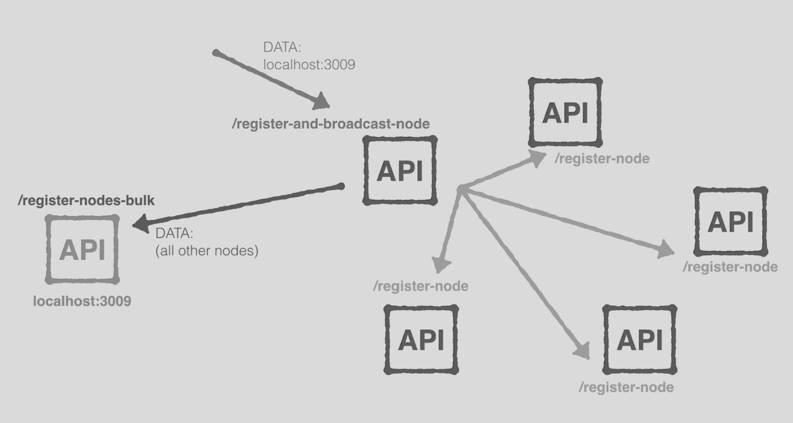
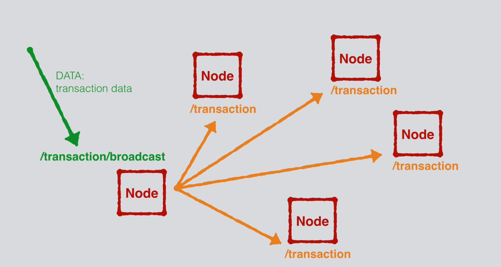
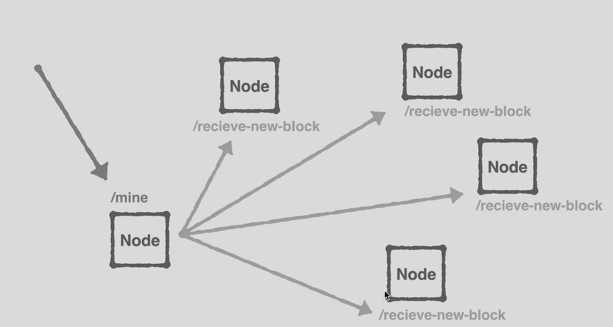

# thoschu/ch.techstack.blockchain

⚠️ UNDER CONSTRUCTION ⚠️

##

❶
```
npm install 
or
npm ci
```

❷
```
npm start
```

❸
```
http://loclahost:3001/
```

## blockchain.js

```javascript
function Blockchain(currentNodeUrl, nodeIdentifier) {}
```

```javascript
Blockchain.prototype.getAddressData = function (address) {}
```

```javascript
Blockchain.prototype.getTransactionById = function (transactionId) {}
```

```javascript
Blockchain.prototype.getBlockByHash = function (blockHash) {}
```

```javascript
Blockchain.prototype.isChainValid = function (blockchain) {}
```

```javascript
Blockchain.prototype.currentBlockData = function () {}
```

```javascript
Blockchain.prototype.proofOfWork = function (previousBlockHash, currentBlockData) {}
```

```javascript
Blockchain.prototype.hashBlock = function (previousBlockHash, currentBlockData, nonce) {}
```

```javascript
Blockchain.prototype.hash = function (dataAsString) {}
```

```javascript
Blockchain.prototype.createNewTransaction = function(amount, sender, recipient) {}
```

```javascript
Blockchain.prototype.addTransactionToPendingTransaction = function(newTransaction) {}
```

```javascript
Blockchain.prototype.getLastBlock = function() {}
```

```javascript
Blockchain.prototype.createNewBlock = function(nonce, previousBlockHash, hash) {}
```

## server.js

```ecmascript 6
const route = {
    method: 'GET',
    path: '/blockchain',
    handler: (request, h) => {}
};
```

```ecmascript 6
const route = {
    method: 'GET',
    path: '/blockchain/hash',
    handler: (request, h) => {}
};
```

```ecmascript 6
const route = {
    method: 'POST',
    path: '/transaction',
    handler: (request, h) => {}
};
```

```ecmascript 6
const route = {   
    method: 'POST',
    path: '/transaction/broadcast',
    handler: (request, h) => {}
};
```

```ecmascript 6
const route = {         
    method: 'GET',
    path: '/mine',
    handler: (request, h) => {}
};
```

```ecmascript 6
const route = {
    method: 'POST',
    path: '/receive-new-block',
    handler: (request, h) => {}
};
```

```ecmascript 6
const route = {
    method: 'POST',
    path: '/register-and-broadcast-node',
    handler: (request, h) => {}
};
```

```ecmascript 6
const route = {
    method: 'POST',
    path: '/register-node',
    handler: (request, h) => {}
};
```

```ecmascript 6
const route = {    
    method: 'POST',
    path: '/register-nodes-bulk',
    handler: (request, h) => {}
};
```

```ecmascript 6
const route = {    
    method: 'GET',
    path: '/consensus',
    handler: (request, h) => {}
};
```

```ecmascript 6
const route = {    
    method: 'GET',
    path: '/block/{blockHash?}',
    handler: (request, h) => {}
};
```

```ecmascript 6
const route = {    
    method: 'GET',
    path: '/transaction/{transactionId?}',
    handler: (request, h) => {}
};
```

```ecmascript 6
const route = {    
    method: 'GET',
    path: '/address/{addresse?}',
    handler: (request, h) => {}
};
```

## 💡







#

Software made with  in Hamburg - Germany.
